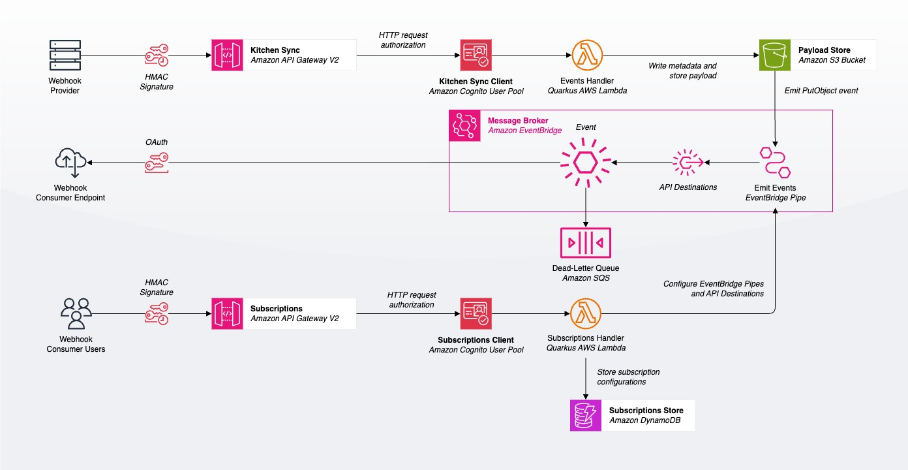

# RESThooks on Quarkus (Jakarta)

This is a flavor of RESThooks implementation, but on Quarkus, the Supersonic Subatomic Jakarta Framework.




> Originally, this was created to tryout AOT-like native images for Serverless Lambdas on AWS.

## About this repo

In case you were wondering, this code is:

- Originally, written on a Mac with Development Container, in Georgia, US.
- Written in Jakarta with Visual Studio Code
- Built and packaged with Quarkus and GraalVM, thanks to Docker
- Pub/Sub as Fanout on Amazon EventBridge
- Served [on AWS](https://aws.amazon.com/products/application-integration/), thanks to Terraform


## Quick start

[](https://vscode.dev/redirect?url=vscode://ms-vscode-remote.remote-containers/cloneInVolume?url=https://github.com/kosperera/skol-resthooks-try-quarkus)

You can also run this repo locally by following these repetitive steps:

1. You want to ensure this repo is cloned to your local machine, and
2. Open it in Visual Studio Code.

See pre-built dev container images in [Microsoft Registry](https://mcr.microsoft.com/en-us/catalog?search=devcontainers) for other variations that suites your hardware.

## Publishing

At present this codebase is published to AWS using Terraform. First, you want to make sure you are logged into `aws` CLI and Mock Server is up and running. *Mocking with the Postman API* is a good source to setup a few API endpoints with a mock server.

With Visual Studio Code:

- Refresh AWS credentials;

  ```shell
  # Set defaults
  export AWS_{DEFAULT_,,EB_}PROFILE="<profile-name>"
  export AWS_PROFILE_REGION="$(aws configure get region)"
  # Export credentials
  eval "$(aws configure export-credentials --format env)"
  ```

- Package the lambda functions;

  ```shell
  ./mvnw clean install package -Dnative
  ```

- Switch to `/deployments/backend` folder to create AWS resources

- Create a `terraform.tfvars` file according to `.tfvars.schema`

- Paste values from your Mock Server

- Publish

  ```shell
  cd deployments/backend
  terraform init -upgrade # Optional.
  terraform plan
  terraform apply -auto-approve
  ```

That's it. 


## Verifying

To verify if everything's working as expected, [Mocking with the Postman](https://www.youtube.com/watch?v=7BowehJJrbA) is one of the faster ways to setup a few API endpoints and a mock server. Then you can receive notifications!

With Visual Studio Code:

- Switch to `/tests/e2e` folder to tryout HTTP requests
- Create a `.env` file according to `.env.schema`
- Paste the values from AWS and your Mock Server
- Send messages with `post-messages.http` file


## License

The source code is license under the [MIT license](#MIT-1-ov-file).

